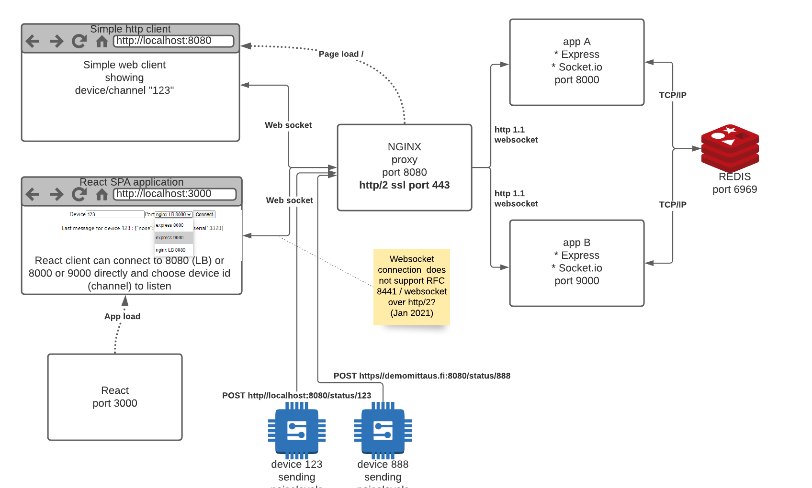

# simple poc for using socket.io for  demo purposes



Certainly ugly

We have redis and 2 servers app A and appB (appa and appb) running socket.io library and
Redis connecting them

Servers are simple express servers with node and socket.io libraries
There is simple html front-end which only listens sockets and devicedata messages.
If you try to send from  html clients they send devicecommand messages but they do nothing.

There is also authentication layer (dummy one) to demonstrate how to authenticate listeners

Very  ugly and simple React client is listening port 3000. It can connect directly to app A listening port 8000 or B listening port 9000 or nging listening port 8080 which acts as Sticky style load balancher between A and B. 

React client you can also select which device ID you connect.  (html clients is listening only device 123).  Devices are impelemted using socket.io channels.

You can send messages "from devices" by connecting

`POST http://localhost:8080/status/:deviceid`  or port 9000 or 8080
with curl or insomnia or some other rest client

```
POST http://localhost:8080/status/123
{
    "noicelevel": 123,
    "whateverdata":"data"

}
```

## Usage

`docker-compose up`

open browser on http://localhost:3000 (react client) or through load balancher http://localhost:8080, which opens either app A or app B simplme html client listening device 123 

With react client you can choose what ever "device" (aka channel) you like.

send message using curl post or REST client to port 8080 (or 8000,9000)

All messages are spread between app A and app B.


# Under MIT license and sources

This work is under MIT license

Sources:
https://socket.io/docs/v3/using-multiple-nodes/
https://socket.io/docs/v3/
https://socket.io/get-started/chat/ following example but changing channels and rooms to
devices 


